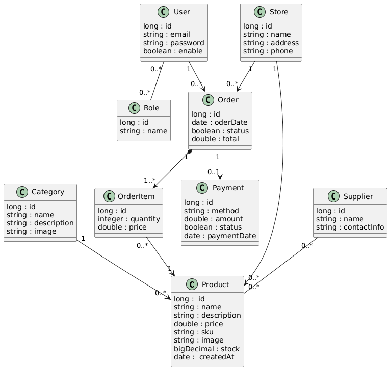

# StockFlow API

StockFlow is a REST API for managing product catalogs and inventory.

It provides a structured backend service that supports product lifecycle management, search, and stock tracking — similar to the backend needs of small to mid-size e-commerce systems.

---

## Core Features

- Product management (CRUD)
- Inventory tracking per product
- Soft deletion to preserve historical data
- Pagination and sorting for large datasets
- Dynamic product filtering (price, stock, name, SKU)
- RESTful API design with clear resource modeling
-Input validation and centralized exception handling

---

## UML - Domain Model

The domain model is designed to reflect a realistic catalog/inventory structure and maintain separation between persistence and API layers.

## Product Filtering

StockFlow includes a dynamic filtering module designed for real catalog search scenarios.

Supported filters:

- Case-insensitive name search
- Price range filtering
- Stock range filtering
- Pagination and sorting

Example:
**GET** /api/products?name=ring&minPrice=10&maxPrice=50&page=0&size=10
- [Product filtering module details](docs/product-filter-module.md)

This allows clients to implement flexible product search similar to e-commerce filtering experiences.

---

## Product CRUD

Supports full product lifecycle management:

- Create products
- Update product details
- Soft delete products (logical deletion)
- Retrieve active catalog items

Soft deletion helps preserve historical integrity and prevents accidental data loss.

- [Product CRUD module details](docs/product-crud-module.md)

## Tech Stack

- Java  
- Spring Boot  
- Spring Data JPA  
- MySQL / SQL Database  
- Maven
- Swagger  

---

## Purpose

StockFlow is a learning-driven but realistically designed backend service that explores:

- REST API design
- Data modeling with JPA
- Filtering and pagination strategies
- Validation and error handling patterns
- Separation of concerns in layered architecture

The goal is to simulate how a real catalog/inventory backend might be structured while keeping the project maintainable and extensible.

---
