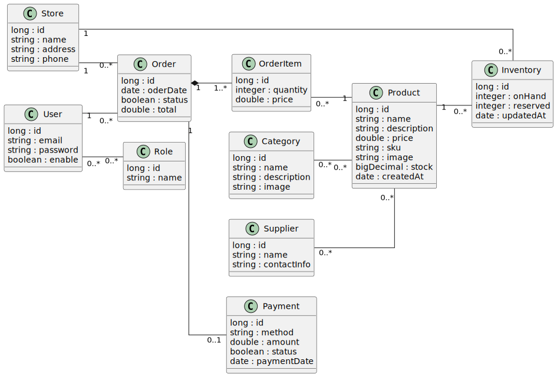
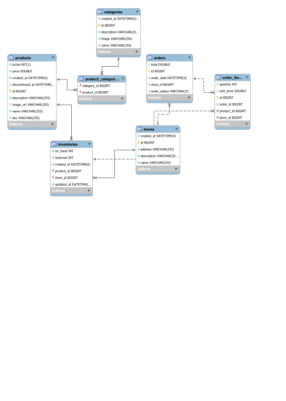

# StockFlow API

Backend system for managing multi-store inventory, tracking stock lifecycle, and handling order workflows using a normalized data model and secure role-based access.

---

## Key Features

- Multi-store inventory management
- Product & category management with SKU tracking
- Order lifecycle handling (cart → checkout → fulfillment → cancellation)
- Stock tracking and automatic updates
- Role-based access control (RBAC) with JWT authentication
- Dynamic filtering, sorting, and pagination
- RESTful API design
- API documentation with Swagger

---

## Tech Stack
- Java
- Spring Boot
- Spring Security (JWT)
- JPA / Hibernate
- MySQL
- Maven

---

## Authentication

This API uses JWT (JSON Web Tokens) for authentication and authorization.

Flow:

1. User logs in via /auth/login
2. Server returns JWT token
3. Token is included in subsequent requests
4. Requests are validated via security filters

---

## Key Endpoints

| Method | Endpoint | Description |
|--------|----------|-------------|
| POST | /auth/login | Authenticate user |
| GET | /products | Get all products |
| POST | /products | Create product |
| PUT | /inventory/update | Update stock |
| GET | /orders | Retrieve orders |
| POST | /orders | Create order |

---

## Architecture Highlights

- Package-by-feature structure for modular scalability
- Layered architecture (Controller → Service → Repository)
- DTO pattern to separate API contracts from entities
- Normalized relational database design to ensure data integrity
- Clear separation of business logic and persistence layer
- Designed to simulate real-world backend systems

---

## System Design

**UML Diagram**

***Entity Relationship Diagram (ERD)**

---

## Deep Dive

**For more detailed explanations:**

- 
- [Product module](docs/product-crud-module.md)
- [Inventory module details](docs/inventory-crud-module.md)
- [Order module details](docs/order-crud-module.md)
- [Product Filter module details](docs/product-filter-module.md)
- [Inventory Filter module details](docs/inventory-filter-module.md)
- [Spring Security - JWT](docs/JWT-module.md)
- [Architecture details](docs/architecture.md)

---

## Purpose

This project was built to model a real-world inventory and order management system, focusing on backend architecture, data integrity, and scalable design patterns.

---

## Future Improvements

- Unit and integration testing
- Docker containerization
- Performance optimization

