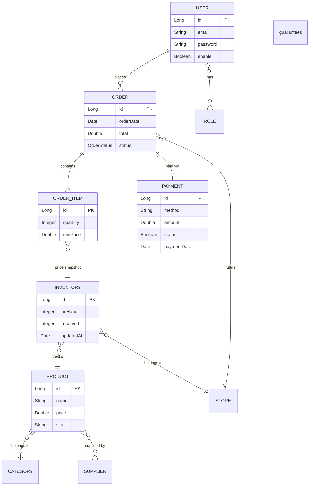

# Cart Module

The cart is implemented as a **session-only snapshot** — `CartItem` is never persisted 
in the database. Instead, it lives in server memory, scoped per user via JWT, and travels 
request-to-request until checkout.

## Why session instead of persistence?

A persistent cart requires its own table, migrations, and cleanup logic. For this system, 
the cart is a temporary intent — not a business record. Keeping it in memory via a 
`Map<userId, Map<productId, CartItem>>` avoids that overhead entirely, while JWT ensures 
each user only accesses their own cart.

## Why `productId` and not the full product?

`CartItem` holds only `productId` + `quantity`. Prices and stock levels change — storing 
a full product snapshot in the cart would require syncing it on every update. Instead, the 
current price is resolved at checkout time directly from `Inventory`, where `OrderItem` 
captures it as an immutable `unitPrice`. This guarantees the order reflects the price at the moment of checkout — 
once persisted in `OrderItem.unitPrice`, it is immutable and unaffected by future price changes.

## Endpoints

| Method | Path | Description |
|--------|------|-------------|
| `POST` | `/api/admin/cart` | Add one or more items to the cart |
| `GET` | `/api/admin/cart` | Retrieve current cart contents |
| `DELETE` | `/api/admin/cart/{productId}` | Remove a specific item from the cart |

> Cart is cleared automatically when `Order` is confirmed and items are persisted as `OrderItem`.

## Domain model

> **Note:** `CartItem` is session-only (JWT, not persisted in DB).
> It holds `productId` + `quantity` in memory and feeds `Order` at checkout,
> where `OrderItem` captures the price snapshot from `Inventory`.